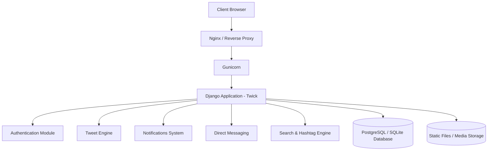
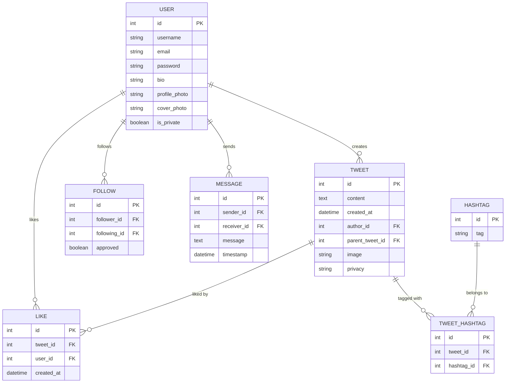

# 🚀 **Twick — A Modern Social Interaction Platform Built with Django**


<!-- Project badges -->


)


---

# 🎥 **Live Demo Preview**

> Replace the GIF once you generate your project preview.


---

# 🏗️ **System Architecture**



---

# 🗄️ **Database Schema Diagram**



---

# 🗺️ **Feature Roadmap**

| Status | Category | Feature | Description |
|--------|----------|----------|-------------|
| ✅ Done | Core | Tweet System | Create, like, retweet, reply, delete |
| ✅ Done | User | Profile + Cover Photo | Bio, company, links, profession |
| ✅ Done | Social | Follow System | Requests, approval, follow suggestions |
| ⏳ In Progress | Chat | Direct Messaging | Real-time UI, conversation list |
| ⏳ In Progress | Feed | Personalized Feed | Intelligent ranking-based timeline |
| ⏳ In Progress | Explore | Trending & Hashtags | Find hashtags, popular tweets |
| 🟦 Planned | AI | Toxicity Detection | ML-based comment moderation |
| 🟦 Planned | AI | Tweet Recommendations | Personalized recommendations |
| 🟦 Planned | Media | Video & Audio Tweets | Upload & playback support |
| 🟦 Planned | Admin | Moderation Dashboard | Analytics + content review |
| 🟦 Planned | DevOps | Full CI/CD Pipeline | Auto-deploy with GitHub Actions |

---

# 📝 **Description**

Twick is a full-scale Django-powered micro-social platform designed with modularity, scalability, and developer extensibility in mind.  
It provides a tweet-driven communication network with hashtags, notifications, messaging, privacy settings, and a fully containerized environment.

This makes Twick ideal for:

- Social platform experiments  
- Academic / portfolio projects  
- AI-enhanced microblogging research  
- Real production deployment with Docker  

---

# ⚙️ **Tech Stack**

### **Backend**
- Python 3.10+
- Django 5.1
- Gunicorn (production)

### **Frontend**
- Django Templates
- Custom CSS
- Vanilla JS

### **DevOps**
- Docker & Docker Compose
- Nginx reverse proxy (planned)
- GitHub Actions CI/CD (planned)
- Shell scripts for automation

---

# 📦 **Dependencies**

```
asgiref: 3.8.1
Django: 5.1.1
pillow: 10.2.0
sqlparse: 0.5.1
gunicorn: 21.2.0
```

---

# 📁 **Project Structure**

```
Twick/
├── Dockerfile
├── Dockerfile.prod
├── docker-compose.yml
├── docker-compose.prod.yml
├── documentation_site/
│   ├── assets/
│   ├── home.html
│   ├── index.html
│   └── pages/
├── extras/
│   ├── cleanup_trash_files.py
│   ├── start.sh
├── static/
│   ├── css/
│   └── images/
├── templates/
│   ├── components/
│   ├── layout.html
│   ├── home.html
│   └── registration/
├── tweet/
│   ├── models.py
│   ├── views.py
│   ├── urls.py
│   ├── utils.py
│   └── templates/
└── twick/
    ├── settings.py
    ├── production.py
    └── wsgi.py
```

---

# 🛠️ **Development Setup**

```bash
git clone https://github.com/KaranPatelDev/Twick.git
cd Twick
python -m venv venv
source venv/bin/activate  # Windows: venv\Scripts\activate
pip install -r requirements.txt
python manage.py migrate
python manage.py runserver
```

---

# 🐳 **Docker Setup**

### Development
```bash
docker-compose up --build
```

### Production
```bash
docker-compose -f docker-compose.prod.yml up --build
```

---

# 📚 **Documentation**

Open the offline docs:

```
documentation_site/index.html
```

---

# 🤝 **Contributing**

Pull requests and feature proposals are welcome!

---

# 📄 **License**
MIT License  
